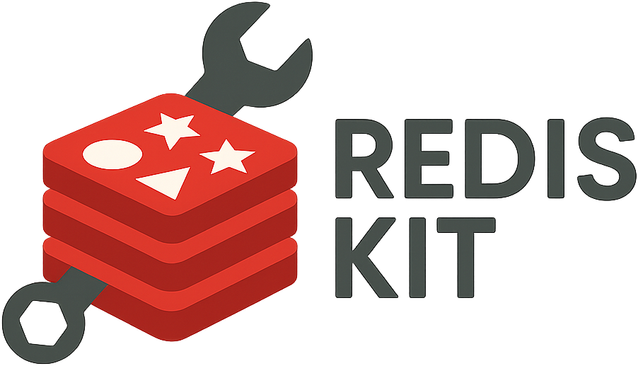

<div align="center">



# RedisKit

**Production-ready Redis utilities and libraries for Node.js applications**

[](https://opensource.org/licenses/MIT)
[](https://www.typescriptlang.org/)
[](https://nodejs.org/)
[](https://nx.dev)

_Distributed locking • High performance • Type-safe • Battle-tested_

</div>

## Overview

RedisKit is a collection of production-ready Redis utilities designed for modern Node.js applications. Built with TypeScript and focused on reliability, performance, and developer experience.

## Packages

### [@redis-kit/lock](./packages/lock)

Distributed locking library implementing the Redlock algorithm with automatic lifecycle management.

```bash
npm install @redis-kit/lock
```

**Key Features:**

- Fault-tolerant distributed locking across multiple Redis instances
- Automatic lock extension for long-running operations
- Full TypeScript support with comprehensive type definitions
- Production-tested with clock drift compensation and retry logic

## Quick Start

```typescript
import { Redlock } from '@redis-kit/lock';
import { createClient } from 'redis';

// Set up Redis clients
const clients = [
  createClient({ host: 'redis1.example.com' }),
  createClient({ host: 'redis2.example.com' }),
  createClient({ host: 'redis3.example.com' }),
];

await Promise.all(clients.map((client) => client.connect()));

// Create distributed lock
const redlock = new Redlock(clients);

// Use the lock
await redlock.withLock('critical-resource', 30000, async () => {
  // Your critical section here
  await performCriticalOperation();
});
```

## Development

This project uses [Nx](https://nx.dev) for monorepo management and build orchestration.

### Prerequisites

- Node.js 18+
- pnpm (recommended package manager)

## Architecture

RedisKit follows these principles:

- **Type Safety**: Full TypeScript support with strict typing
- **Production Ready**: Battle-tested with comprehensive error handling
- **Developer Experience**: Simple APIs with sensible defaults
- **Performance**: Optimized for high-throughput applications
- **Reliability**: Fault-tolerant designs with proper retry mechanisms

## License

MIT - see the [LICENSE](LICENSE) file for details.

## Support

- 📖 [Documentation](https://redis-kit.dev) (coming soon)
- 🐛 [Issue Tracker](https://github.com/your-org/redis-kit/issues)
- 💬 [Discussions](https://github.com/your-org/redis-kit/discussions)
